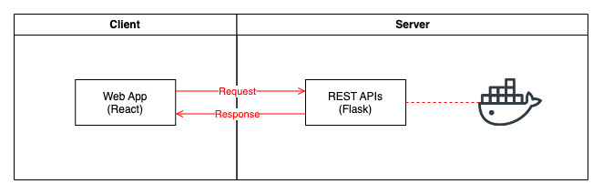

# SAP Assignment

This project contains two parts:

- A frontend Web App for users to list Docker images and build Docker images by uploading *Dockerfile*
- A backend App to serve RESTful APIs



## Directory Structure

    .
    ├── README.md
    ├── backend                  # Backend code
    │   ├── app.py               # Flask app
    │   └── requirements.txt     # Python dependencies list
    ├── frontend                 # Frontend code
    │   └── ...
    ├─ uploaded_dockerfiles      # Directory to store files uploaded by users
    │   └── ...
    └─── helloworld.dockerfile   # A Dockerfile for testing

## Backend

The backend is built on top of [Flask](https://flask.palletsprojects.com/en/3.0.x/) - a web framework based on Python.

### Backend - Prerequisites

- Docker Engine
- Python >= 3.8

### Backend - Getting started

1. Create a Python virtual environment:

    ```sh
    cd backend
    python3 -m venv venv
    source venv/bin/activate
    ```

2. Install dependencies:

    ```sh
    pip3 install -r requirements.txt
    ```

3. Start in development mode:

    ```sh
    python3 app.py
    ```

## Frontend

The frontend is built on top of [react-admin](https://github.com/marmelab/react-admin) - an open source framework for creating B2B apps based on [React](https://react.dev/).

### Frontend - Prerequisites

- Node.js >= 18.16

### Frontend - Getting started

1. Install dependencies:

    ```sh
    cd frontend
    npm install
    ```

2. Start in development mode:

    ```sh
    npm run dev
    ```

3. Build for production:

    ```sh
    npm run build
    ```
