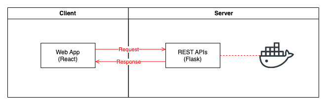
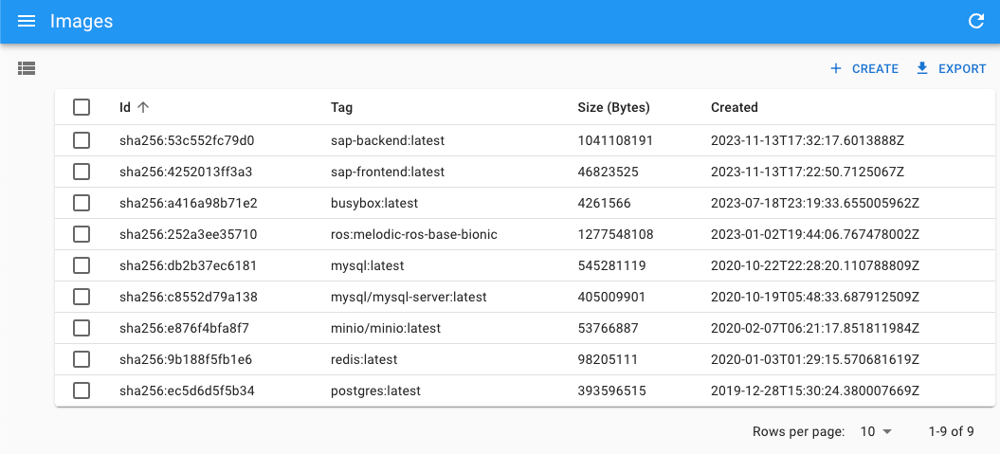
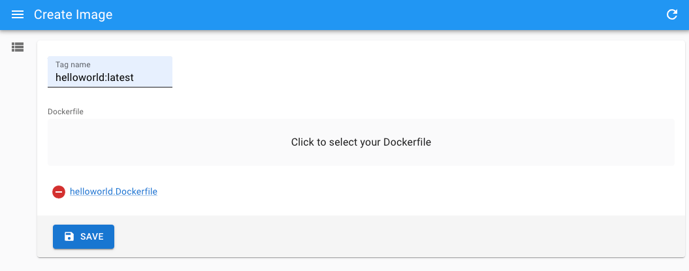

# SAP Assignment

This project contains two parts:

- A frontend Web App for users to list Docker images and build Docker images by uploading *Dockerfile*
- A backend App to serve RESTful APIs



## Directory Structure

    .
    ├── backend                  # Backend code
    │   ├── app.py                  # Flask app
    │   ├── test_app.py             # Unit tests
    │   └── requirements.txt        # Python dependencies list
    ├── frontend                 # Frontend code
    │   └── ...
    ├── .gitignore
    ├── docker-compose.yml       # Docker Compose file
    ├── helloworld.dockerfile    # A Dockerfile for testing
    └── README.md

## Backend

The backend is built on top of [Flask](https://flask.palletsprojects.com/en/3.0.x/) - a web framework based on Python.

The backend serves the following API endpoints:

| Method   | URL                                | Description                                  | Request Payload Example                  |
| -------- | ---------------------------------- | -------------------------------------------- | ---------------------------------------- |
| `GET`    | `/`                                | Just for health check.                       |                                          |
| `GET`    | `/images`                      | Retrieve all images.                         |                                          |
| `POST`   | `/images`                      | Create a new image by uploading a Dockerfile.| {"tag_name": "image:latest", "dockerfile": file} |

## Frontend

The frontend is built on top of [react-admin](https://github.com/marmelab/react-admin) - an open source framework for creating B2B apps based on [React](https://react.dev/).

The frontend provides the following views:

Docker Image List Page            |  Docker Image Upload Page
:-------------------------:|:-------------------------:
 | 
<!--   |   -->

## Getting Started

### Option 1: Run in Docker (Recommended)

---

### Prerequisites

- Docker Engine

### Frontend + Backend

```sh
# Start all at once
docker compose up

# Clear all containers
docker compose down
```

> Then access backend at [localhost:8000](http://localhost:8000) + frontend at [localhost:8080](http://localhost:8080)

### Option 2: Run on local machine

---

### Prerequisites

- Docker Engine
- Python >= 3.8
- Node.js >= 18

### Backend

```sh
cd backend

# [For the first time] Create a Python virtual environment
python3 -m venv venv

# Enter Python virtual environment
source venv/bin/activate

# Install dependencies
pip install -r requirements.txt

# Run backend
python app.py
```

> Then access backend at [localhost:8000](http://localhost:8000)

### Frontend

```sh
cd frontend

# Install dependencies
npm install

# Run frontend
npm run dev

# Build frontend
npm run build
```

> Then access frontend at [localhost:8080](http://localhost:8080)

## Unit Tests (For backend)

1. Enter Python virtual environment:

    ```sh
    cd backend
    source venv/bin/activate
    ```

2. Run test:

    ```sh
    python -m pytest test_app.py
    ```
